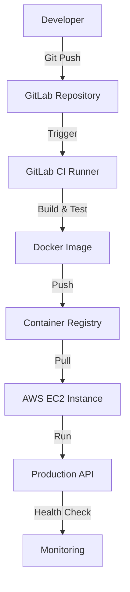

# 📊 DATA DRIVE - CI/CD Pipeline State

This document tracks the technical state, architecture, and data flow of the Automated CI/CD Pipeline.

## 🏗️ Architecture Diagram

## 🛠️ Infrastructure Data
| Component | Provider | Configuration |
| :--- | :--- | :--- |
| **Compute** | AWS EC2 | t2.micro (Linux) |
| **Runtime** | Docker | Engine v20.x |
| **Orchestration** | GitLab CI | .gitlab-ci.yml |
| **Network** | Security Groups | Port 80 (HTTP), 22 (SSH) |

## 📡 API Endpoints Data
| Endpoint | Method | Response | Description |
| :--- | :--- | :--- | :--- |
| `/health` | GET | `{"status": "UP"}` | Service health indicator |
| `/hello` | GET | `{"message": "Hello from CI/CD!"}` | Simple static greeting |

## 🔄 Deployment States
1. **PENDING**: New code pushed, waiting for runner.
2. **BUILDING**: Dependencies installing, image creating.
3. **TESTING**: Unit tests executing.
4. **PUSHING**: Image uploaded to registry.
5. **DEPLOYING**: SSH command sent to EC2 to pull & restart.
6. **SUCCESS**: Health check passed on server.
7. **FAILURE**: Any stage failed, deployment aborted.

## 🔐 Environment Variables Required
| Variable | Description | Source |
| :--- | :--- | :--- |
| `DOCKER_USER` | Registry username | GitLab CI Secret |
| `DOCKER_PASS` | Registry password | GitLab CI Secret |
| `SERVER_IP` | EC2 Public IP | GitLab CI Secret |
| `SSH_PRIVATE_KEY` | Key for EC2 access | GitLab CI Secret |
